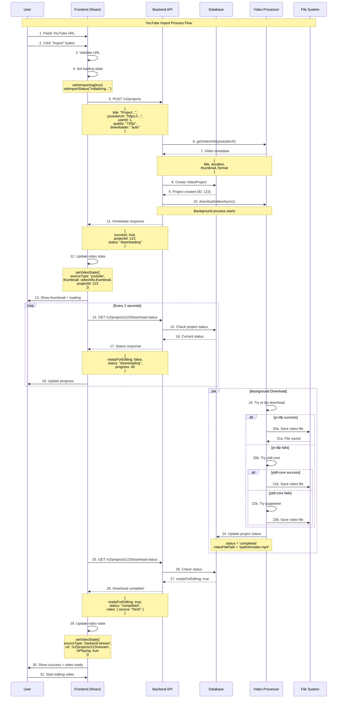
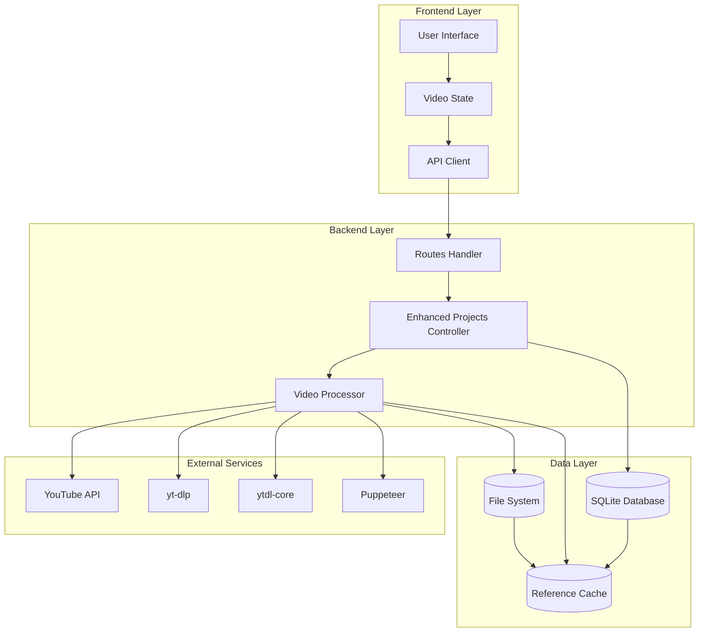
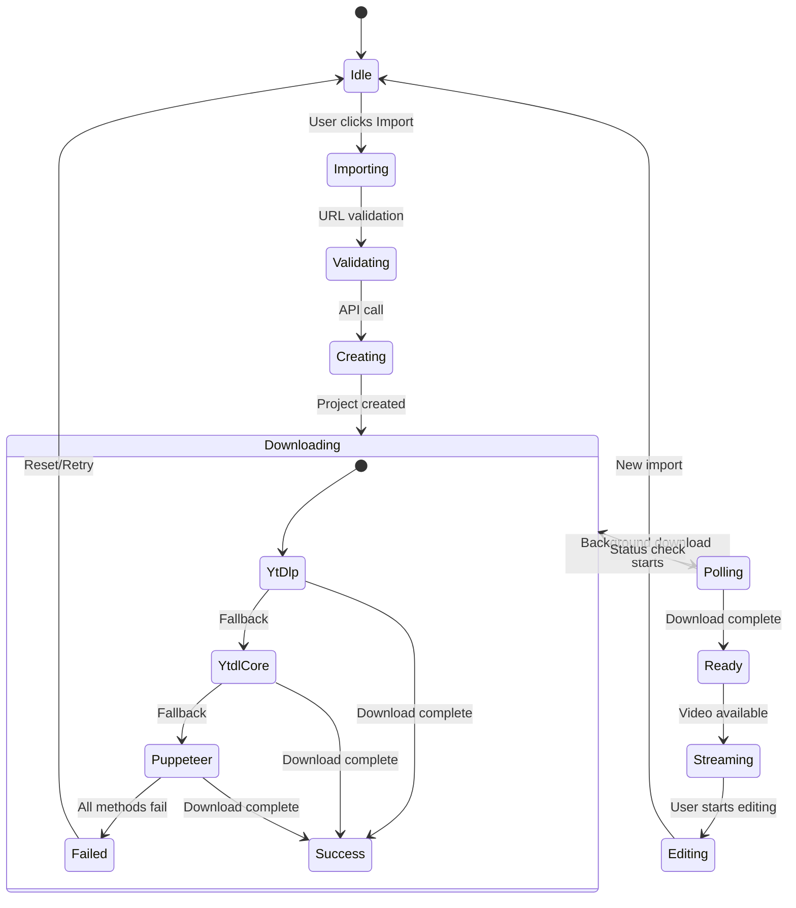
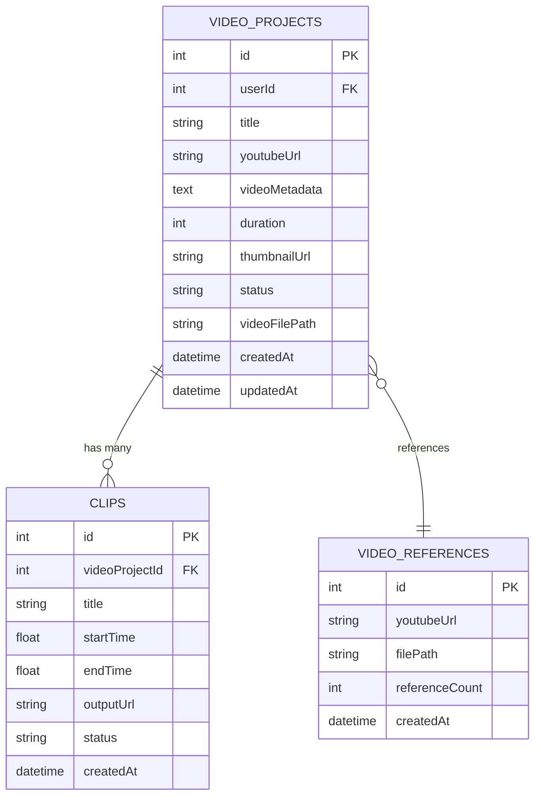
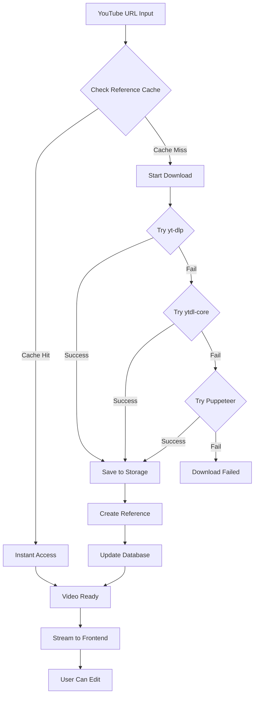
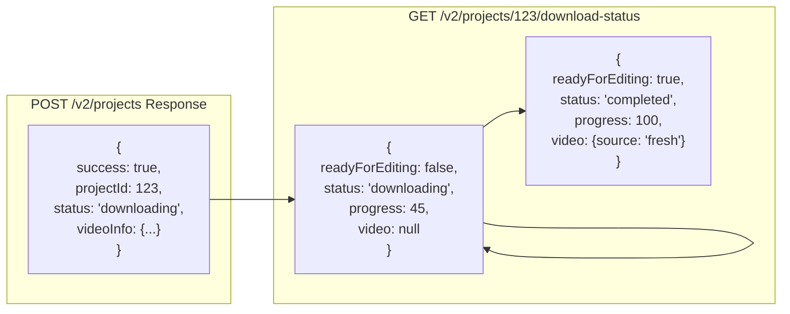
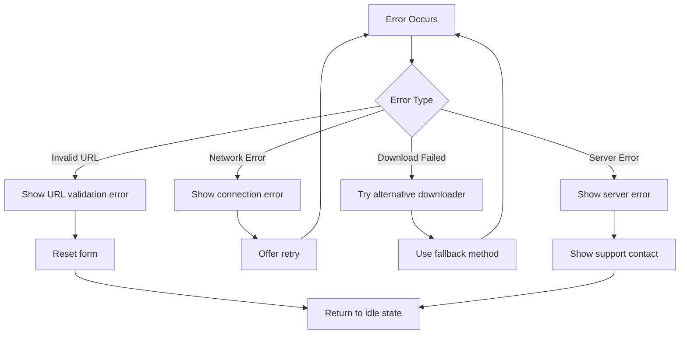

# 🎬 YouTube Import Flow Diagram - Pocat

## 📊 Complete System Flow



## 🏗️ Architecture Components



## 🔄 State Transitions



## 📱 Frontend Component Flow

```mermaid
graph LR
    subgraph "EditorView Component"
        INPUT[YouTube URL Input]
        BUTTON[Import Button]
        PLAYER[Video Player]
    end
    
    subgraph "App Component State"
        YT_LINK[youtubeLink]
        IS_IMPORTING[isImporting]
        IMPORT_STATUS[importStatus]
        VIDEO_STATE[videoState]
    end
    
    subgraph "API Services"
        CREATE_PROJECT[createProject()]
        GET_STATUS[getProjectDownloadStatus()]
    end
    
    INPUT --> YT_LINK
    BUTTON --> IS_IMPORTING
    IS_IMPORTING --> CREATE_PROJECT
    CREATE_PROJECT --> IMPORT_STATUS
    IMPORT_STATUS --> GET_STATUS
    GET_STATUS --> VIDEO_STATE
    VIDEO_STATE --> PLAYER
```

## 🗄️ Database Schema Flow



## 🚀 Performance Optimization Flow



## 📊 API Response Flow



## 🎯 Error Handling Flow



---

**Diagram Version**: 1.0  
**Created**: December 18, 2025  
**Components**: Frontend (React) + Backend (AdonisJS) + Video Processing  
**Flow Type**: YouTube Import & Download Process
